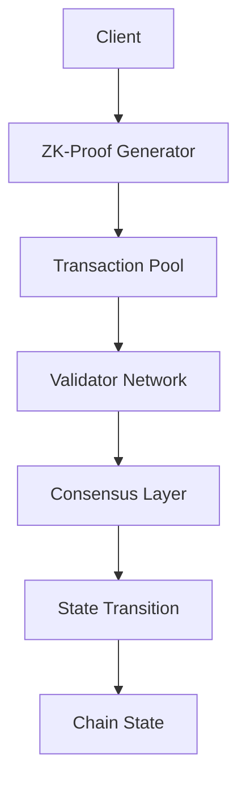

<p align="center">
  <a href="https://aporia-zero.io">
    
  </a>
</p>

> [!IMPORTANT]
> `main` is the development branch.

# Aporia Zero

> Next-generation zero-fee blockchain protocol with advanced privacy features and identity-based proof-of-stake consensus

## Table of Contents
- [Overview](#overview)
- [Core Components](#core-components)
- [Technical Architecture](#technical-architecture)
- [Mathematical Foundation](#mathematical-foundation)
- [Consensus Mechanism](#consensus-mechanism)
- [Zero-Fee Structure](#zero-fee-structure)
- [Security Model](#security-model)
- [Performance](#performance)
- [Implementation](#implementation)

## Overview

Aporia Zero is a revolutionary blockchain protocol that combines zero-knowledge proofs, identity-based consensus, and a unique zero-fee transaction model. It addresses key challenges in blockchain technology:

- **Privacy**: Advanced zero-knowledge protocols
- **Scalability**: High-performance consensus mechanism
- **Accessibility**: Zero-fee transaction structure
- **Security**: Identity-based validation system

## Core Components

### 1. ZK-Identity Proof of Stake (ZK-IPS)
- Identity verification without data exposure
- Stake-weighted consensus mechanism
- Validator selection based on identity proofs
- Privacy-preserving participation

### 2. Zero-Fee Architecture
- Proof-of-Computation (PoC) fee structure
- Resource-based transaction priority
- Computational credit system
- Dynamic resource allocation

### 3. Privacy Framework
- Zero-knowledge transaction layer
- Identity commitment scheme
- Private state transitions
- Recursive proof composition

## Technical Architecture

### Consensus Layer
```python
P(v) = min(stake(v) · IdWeight(v), MaxProb)

Where:
IdWeight(v) = 1 - H(commit(v)) / 2^256
commit(v) = identity commitment
MaxProb = maximum selection probability
```

### Transaction Processing
```rust
struct TransactionCircuit {
    // Public inputs
    amount: Num<Fr>,
    sender_commitment: Point<Fr>,
    receiver_commitment: Point<Fr>,
    merkle_root: Num<Fr>,
    nullifier: Num<Fr>,

    // Private inputs (witness)
    sender_private_key: Num<Fr>,
    sender_balance: Num<Fr>,
    merkle_path: Vec<(Point<Fr>, bool)>,
    blinding_factor: Num<Fr>,
    plaintext_data: Vec<Num<Fr>>,
}
```

## Mathematical Foundation

### Identity Commitment Scheme

The system uses a modified Pedersen commitment scheme:

```
Setup(1^λ) → pp:
- Generate bilinear groups (G₁, G₂, GT) of prime order p
- Choose random τ ← Fp
- Compute powers (g₁, g₁^τ, ..., g₁^(τⁿ)) and (g₂, g₂^τ)
- pp = (G₁, G₂, GT, g₁, g₂, {g₁^(τⁱ)}ᵢ₌₀ⁿ, g₂^τ)

Commit(pp, f(X)) → C:
- For polynomial f(X) = ∑ᵢ fᵢXⁱ
- C = ∏ᵢ (g₁^(τⁱ))^fᵢ = g₁^f(τ)
```

### ZK-SNARK Construction

Using Groth16 protocol:

```
Setup(R, 1^λ) → (pk, vk):
- Generate proving key pk and verification key vk
- pk includes elements in G₁ and G₂
- vk includes elements for efficient verification

Prove(pk, x, w) → π:
- Generate proof π = (πA, πB, πC)
- πA ∈ G₁, πB ∈ G₂, πC ∈ G₁
- Proof size is constant (3 group elements)
```

## Consensus Mechanism

### Validator Selection Process

| Component | Description | Formula |
|-----------|-------------|---------|
| Stake Weight | Validator's staked amount | S(v) = stake(v) / total_stake |
| Identity Weight | Privacy-preserving identity factor | I(v) = H(C_v \|\| epoch) / 2^256 |
| Selection Probability | Combined selection chance | P(v) = min(α * S(v) * I(v), P_max) |

### Block Production

1. Leader Selection:
   - VRF-based random selection
   - Proof of eligibility verification
   - Multi-leader backup system

2. Block Validation:
   - ZK proof verification
   - State transition validation
   - Signature verification
   - Consensus rules enforcement

## Zero-Fee Structure

### Computational Offset Model

| Resource | Measurement | Scaling |
|----------|-------------|---------|
| CPU Cycles | Computational work | Linear |
| Memory Usage | RAM consumption | Logarithmic |
| Bandwidth | Network usage | Square root |
| Storage | Chain state impact | Linear |

### Credit System

```python
Credit = g(W) where:
- W is computational work
- g is credit generation function
- g(W) has diminishing returns
- min(g(W)) > spam_threshold
```

## Security Model

### Threat Resistance

| Attack Vector | Defense Mechanism | Security Level |
|---------------|-------------------|----------------|
| Sybil Attack | Identity Verification | Very High |
| Nothing-at-Stake | Stake Slashing | High |
| Long-range Attack | Checkpoint System | High |
| DoS Attack | Computation Requirement | Very High |

### Safety Guarantees

```
P(fork) ≤ (f/n)^c

Where:
n = total validators
f = Byzantine validators
c = confirmation depth
```

## Performance

### Benchmarks

| Metric | Value | Notes |
|--------|-------|-------|
| TPS | 1,000-5,000 | Base Layer |
| Latency | 2-3 seconds | Block Time |
| Finality | ~6 seconds | w/Confirmation |
| Proof Size | ~1KB | Per Transaction |

### Scalability Features

- Recursive proof composition
- Parallel validation
- State sharding
- Dynamic batching

## Implementation

### Core Components

```rust
impl ZKIdentityProof {
    fn generate_identity_proof(self, private_identity) -> Proof;
    fn verify_stake(self, proof, public_params) -> bool;
    fn update_validator_set(self) -> ValidatorSet;
}
```

### Network Architecture



## Future Development

### Roadmap

1. **Phase 1**: Core Protocol
   - Consensus implementation
   - Basic transaction system
   - Identity framework

2. **Phase 2**: Advanced Features
   - Smart contracts
   - Layer 2 scaling
   - Cross-chain bridges

3. **Phase 3**: Ecosystem Growth
   - Developer tools
   - Application framework
   - Network expansion

## Contributing

We welcome contributions! Please see our [Contributing Guidelines](CONTRIBUTING.md) for details.

## License

This project is licensed under the [MIT License](LICENSE).
